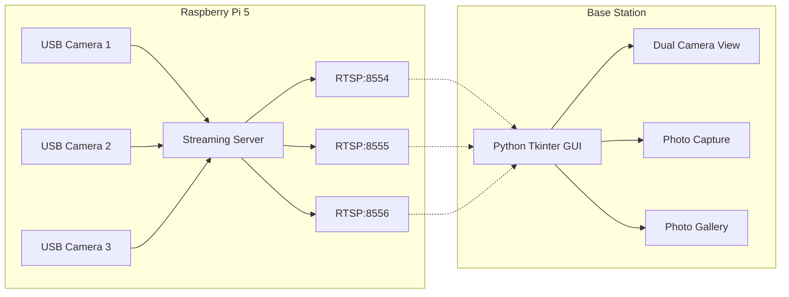

# Rover Camera Streaming System

A complete camera streaming solution for Raspberry Pi with a desktop GUI viewer. Stream multiple USB cameras over RTSP with photo capture and gallery features.

## System Overview

This project consists of two main components:

1. **Raspberry Pi Streaming Server** - Captures video from USB cameras and streams via RTSP
2. **Base Station GUI** - Desktop application to view streams and capture photos

## Features

### Raspberry Pi Server
- Supports 3 USB cameras simultaneously
- RTSP streaming with H.264 encoding
- Automatic camera detection and reconnection
- Configurable resolution and framerate (default: 640x480 @ 15fps)
- Low latency streaming optimized for local network

### Base Station GUI
- Dual camera view with switching capability
- Photo capture from selected cameras
- Built-in photo gallery with sorting and filtering
- Timestamp overlay on streams and photos
- IP configuration dialog with saved addresses
- Keyboard shortcuts for quick access

## Quick Start

### Raspberry Pi Setup

1. Install dependencies:
```bash
cd raspberry_pi
sudo apt-get update
sudo apt-get install -y python3-pip python3-opencv gstreamer1.0-tools \
    gstreamer1.0-plugins-good gstreamer1.0-plugins-bad \
    gstreamer1.0-rtsp libgstrtspserver-1.0-0 python3-gi
pip3 install -r requirements.txt
```

2. Connect USB cameras

3. Run the server:
```bash
python3 pi_streaming_server.py
```

The server will display RTSP URLs for each camera.

### Base Station Setup

1. Install dependencies:
```bash
cd base_station
pip install -r requirements.txt
```

2. Run the GUI:
```bash
python base_station_gui.py
```

3. Configure IP address via File → IP Configuration

4. Click Connect to start streaming

## Architecture



## Configuration

Both components use JSON configuration files:

### Raspberry Pi (`raspberry_pi/config.json`)
- Camera resolution and FPS
- RTSP server ports
- Debug settings

### Base Station (`base_station/config.json`)
- Raspberry Pi IP address
- Display settings
- Photo capture settings
- Overlay preferences

## Network Requirements

- Both devices must be on the same network
- Ports 8554-8556 must be accessible
- Recommended: Wired connection for Pi, WiFi acceptable for base station
- Bandwidth: ~2-3 Mbps per camera stream

## Troubleshooting

### Common Issues

1. **No cameras detected on Pi**
   - Check USB connections
   - Verify camera permissions: `sudo usermod -a -G video $USER`
   - List devices: `ls /dev/video*`

2. **Cannot connect from base station**
   - Verify Pi IP address
   - Check firewall settings
   - Test with VLC: `vlc rtsp://[PI_IP]:8554/cam1`

3. **Poor stream quality**
   - Reduce resolution or FPS
   - Check network congestion
   - Use wired connection for Pi

## Project Structure

```
rover_cameras_base/
├── README.md
├── camera_streaming_architecture.md
├── implementation_plan.md
├── raspberry_pi/
│   ├── pi_streaming_server.py
│   ├── camera_manager.py
│   ├── rtsp_server.py
│   ├── config.json
│   ├── requirements.txt
│   └── README.md
└── base_station/
    ├── base_station_gui.py
    ├── camera_viewer.py
    ├── stream_manager.py
    ├── timestamp_overlay.py
    ├── ip_config_dialog.py
    ├── photo_capture_dialog.py
    ├── photo_gallery.py
    ├── config.json
    ├── requirements.txt
    ├── README.md
    └── captures/
```

## Performance

- Raspberry Pi 5: Can handle 3 cameras at 640x480 @ 15fps
- Network: Total bandwidth ~6-9 Mbps for 3 streams
- Base Station: Minimal CPU usage with hardware acceleration

## Future Enhancements

- [ ] Web interface option
- [ ] Motion detection
- [ ] Video recording
- [ ] PTZ camera support
- [ ] Multiple base station support
- [ ] Cloud storage integration

## License

This project is provided as-is for educational and personal use.

## Contributing

Feel free to submit issues and enhancement requests!