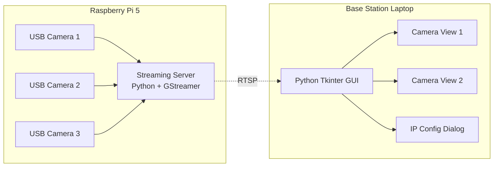

# Camera Streaming System Architecture

## System Overview

This system consists of two main components:
1. **Raspberry Pi 5 Streaming Server** - Captures video from 3 USB cameras and streams via RTSP
2. **Base Station GUI Application** - Displays 2 camera streams simultaneously with switching capability

## Architecture Diagram

## Technical Stack

### Raspberry Pi 5 (Streaming Server)
- **Language**: Python 3
- **Streaming**: GStreamer with RTSP server
- **Camera Access**: OpenCV for USB camera detection
- **Protocol**: RTSP (Real Time Streaming Protocol)
- **Resolution**: 640x480
- **FPS**: 10-20 fps (configurable)

### Base Station (GUI Application)
- **Language**: Python 3
- **GUI Framework**: Tkinter
- **Video Display**: OpenCV + PIL for Tkinter integration
- **RTSP Client**: OpenCV VideoCapture with GStreamer backend
- **Photo Storage**: Local filesystem with timestamp-based naming
- **Image Gallery**: Tkinter-based photo viewer

## Component Details

### 1. Raspberry Pi Streaming Server

**Features:**
- Detects and initializes 3 USB cameras
- Creates 3 RTSP streams on different ports:
  - Camera 1: rtsp://[PI_IP]:8554/cam1
  - Camera 2: rtsp://[PI_IP]:8555/cam2
  - Camera 3: rtsp://[PI_IP]:8556/cam3
- Configurable video parameters (resolution, FPS)
- Error handling for camera disconnections

**Key Files:**
- `pi_streaming_server.py` - Main streaming server
- `config.json` - Configuration file for stream settings
- `requirements.txt` - Python dependencies

### 2. Base Station GUI Application

**Features:**
- Dual camera view layout (2 streams displayed simultaneously)
- Camera switching controls (dropdown or buttons)
- IP configuration dialog
- Connection status indicators
- Stream quality settings
- Save/load IP configurations
- Photo capture dialog with camera selection
- Timestamp overlay on streams and photos
- Built-in photo gallery viewer

**Key Files:**
- `base_station_gui.py` - Main GUI application
- `camera_viewer.py` - Camera view widget
- `ip_config_dialog.py` - IP configuration dialog
- `photo_capture_dialog.py` - Photo capture controls
- `photo_gallery.py` - Photo gallery viewer
- `config.json` - Saved configurations
- `requirements.txt` - Python dependencies
- `captures/` - Directory for saved photos

## Network Configuration

- Both devices must be on the same network
- Required ports: 8554, 8555, 8556 (configurable)
- Firewall rules may need adjustment on Pi

## Data Flow

1. USB cameras capture video frames
2. Pi server encodes frames using H.264
3. GStreamer creates RTSP streams
4. Base station connects to RTSP URLs
5. OpenCV decodes streams
6. Tkinter displays frames in GUI

## Error Handling

- Camera disconnection detection
- Network interruption recovery
- Invalid IP address validation
- Stream timeout handling
- Graceful degradation (if one camera fails, others continue)

## Performance Considerations

- 640x480 @ 15fps requires ~2-3 Mbps per stream
- Total bandwidth: ~6-9 Mbps for 2 active streams
- Pi 5 can handle 3 simultaneous streams easily
- GUI updates at 30fps for smooth display

## Security Notes

- RTSP streams are unencrypted by default
- Consider VPN or secure network for sensitive applications
- Optional: Add authentication to RTSP server

## Photo Capture System

### Capture Workflow
1. User clicks capture button
2. Photo capture dialog opens
3. User selects which cameras to capture (checkboxes)
4. System captures frames from selected streams
5. Photos saved with timestamp: `captures/cam1_2025-08-08_16-00-00.jpg`
6. Gallery updates automatically

### Timestamp Overlay
- Format: `YYYY-MM-DD HH:MM:SS | Camera X`
- Position: Bottom-left corner
- Semi-transparent background for readability
- Applied to both live streams and captured photos

### Photo Gallery Features
- Thumbnail grid view
- Full-size image viewer
- Sort by date/camera
- Delete selected photos
- Export photos to custom location

## Future Enhancements

- Video recording capability
- Motion detection
- PTZ control support
- Multiple base station support
- Web interface option